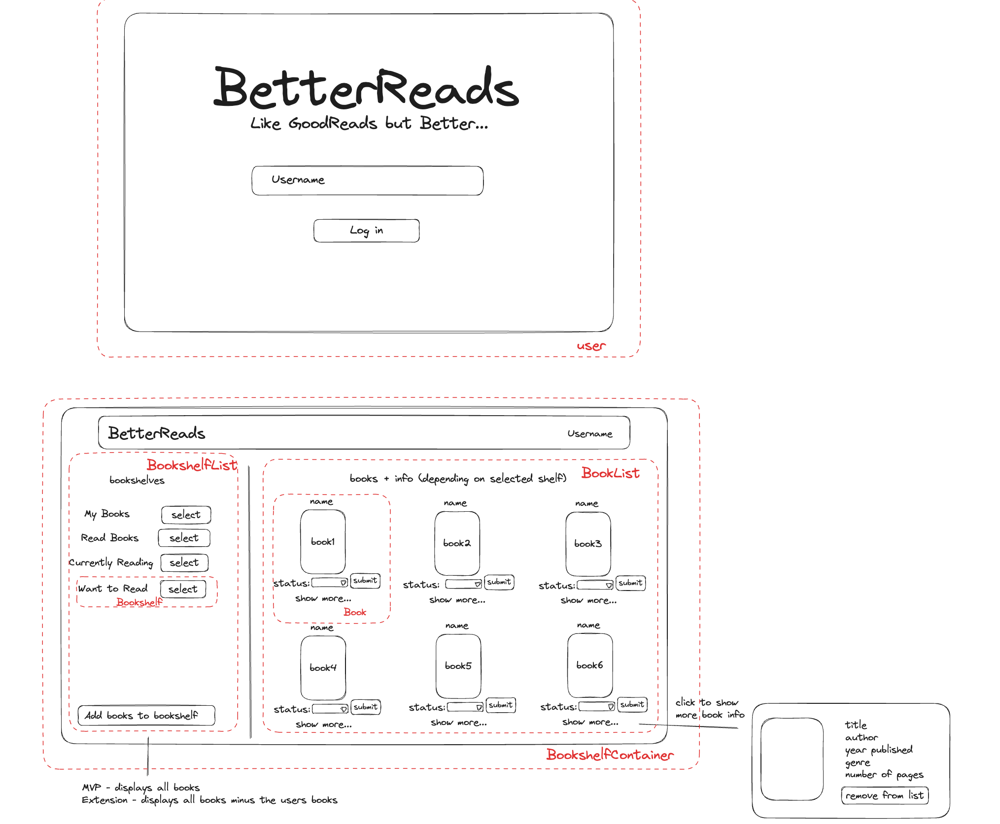

# Better Reads - Digital Book Catalogue

- [Better Reads - Digital Book Catalogue](#better-reads---digital-book-catalogue)
  - [Description](#description)
  - [Demo](#demo)
  - [Setup and Installation](#setup-and-installation)
  - [Tech Stack and Dependencies](#tech-stack-and-dependencies)
    - [Backend](#backend)
    - [Frontend](#frontend)
  - [Diagrams](#diagrams)
    - [Wireframe](#wireframe)
    - [Component Diagram](#component-diagram)
  - [MVP, Extensions, Future Work](#mvp-extensions-future-work)
    - [MVP](#mvp)
    - [Extensions](#extensions)
    - [Summary](#summary)
  - [Backend Information](#backend-information)
  - [**_Collaborators_**](#collaborators)

## Description

This project allows for the user to manage an online digital library of their books, allowing them to keep track of what books they've read, what books they want to read and what books they're currently reading. The user can also add new books to their virtual library from a larger catalogue of books.

## Demo

https://github.com/Zaiyad7/frontend_project/assets/93227269/2f23906f-5e9c-434f-9c18-b117f9130176

## Setup and Installation

This project was done using Spring Boot for the backend and React for the frontend. After cloning/forking the repository a database should be created called bookshelf_db and you should run the main program file BookshelfApplication.java.

After running the server on the backend you will also need to open the folder containing the frontend code (frontend_better_reads) and do an npm i in that directory in order to install the relevant node modules. You can then do an npm start in order to start the application in your browser. In order to login to the book catalogue you will need to login as one of the selected users from the backend database by typing in for example Colin, Anna, Zsolt etc in the username section.

## Tech Stack and Dependencies

This is a list of the tech stack that was used for this project.
To run this project you will need to install IntelliJ IDEA JDK 17, postgresSQL and visual studio code.

### Backend

- IntelliJ IDEA
- JDK 17
- Maven
- postgresSQL
- Spring Boot
- Spring Data JPA
- Spring Web
- PostgresSQL Driver
- Spring DevTools

### Frontend

- Visual Studio Code
- React 18.2.0

## Diagrams

### Wireframe

### Component Diagram

## MVP, Extensions, Future Work

### MVP

- [x] Get an existing user
- [x] Create a bookshelf and add books to it
- [x] Set read books functionality - filter functionality
- [x] Add books to bookshelf - display all books
- [x] Be able to change book status

### Extensions

- [x] Add books to bookshelf button - display all books minus user books
- [ ] Book page displaying book info with images
- [ ] Filter rating
- [ ] Genre dropdown filter
- [ ] Authors page
- [ ] Create a new user
- [ ] Remove from list button

### Summary

We were successful in completing our MVP and one of our extensions. The main extensions we would want to implement
would be to display the book info with more information such as the author, have a remove book from bookshelf option and
the ability to create new users and sign in as those users as well as some form of authentication such as creating an account
with a password. We would also like to utlise react router to have multi-page functionality. Some of the challenges we faced were problems with conditional rendering, having async issues with setting state and having an increasing number of props that we had to keep track of and pass down to lots of components via prop drilling.

## Backend Information

Further information about the backend including its specific README file can be found at
[link](backend_better_reads/README.md)

## **_Collaborators_**

- Blezzy [blezzydcruz](https://github.com/blezzydcruz)
- Zaiyad [Zaiyad7](https://github.com/Zaiyad7)
- Yihang [nehcobiy](https://github.com/nehcobiy)
- Hannah [hadams0](https://github.com/hadams0)

